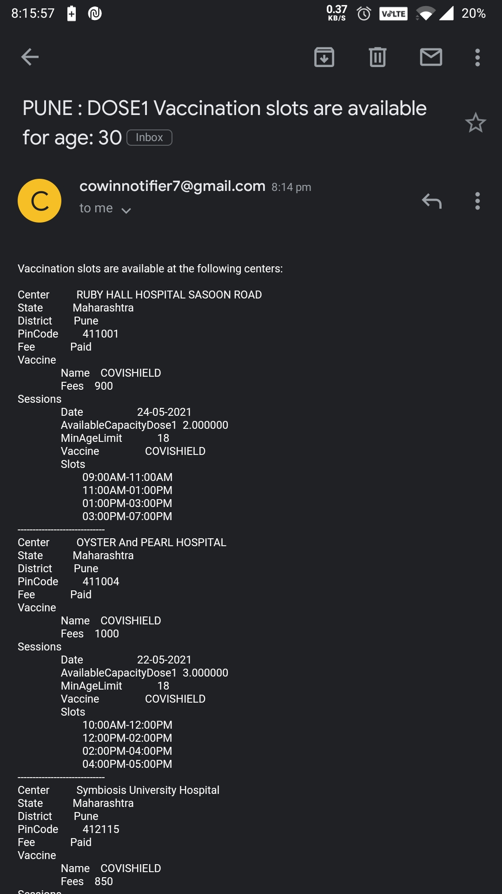

# covaccine-notifier

CoWIN Portal Vaccine availability notifier

covaccine-notifier periodically checks and sends email notifications for available slots for the next 7 days on CoWIN portal in a given area and age.

**Sample screenshot**



## Installation

### Install the pre-compiled binary

```
curl -sfL https://raw.githubusercontent.com/abhinavsinha1991/covaccine-notifier/main/install.sh | sh
```

### Latest Release

https://github.com/abhinavsinha1991/covaccine-notifier/releases/tag/v4.0

### Docker
```
docker pull abhinavsinha1991/covaccine-notifier:v4.0
```

## Usage

covaccine-notifier can monitor vaccine availability either by pin-code or state and district names

```bash
$ ./covaccine-notifier --help
CoWIN Vaccine availability notifier India

Usage:
  covaccine-notifier [FLAGS] [flags]

Flags:
  -a, --age int           Search appointment for age
  -d, --district string   Search by district name
  -o, --dose int          Dose preferences - 1 (or) 2.
  -e, --email string      Email address to send notifications
  -f, --fee string        Fee preferences - free (or) paid. Default: No preference
  -h, --help              help for covaccine-notifier
  -i, --interval int      Interval to repeat the search. Default: (60) second
  -p, --password string   Email ID password for auth
  -c, --pincode string    Search by pin code
  -s, --state string      Search by state name
  -v, --vaccine string    Vaccine preferences - covishield (or) covaxin. Default: No preference

```

**Note:** Gmail password won't work for 2FA enabled accounts. Follow [this](https://support.google.com/accounts/answer/185833?p=InvalidSecondFactor&visit_id=637554658548216477-2576856839&rd=1) guide to generate app token password and use it with `--password` arg 

## Examples

### Terminal

#### Search by State and District

```
covaccine-notifier --state Maharashtra --district Pune --age 30 --dose 1 --email <username@gmail.com> --password <gmail-password>
```

#### Search by Pin Code

```
covaccine-notifier --pincode 411047 --age 30 --dose 1 --email <username@gmail.com> --password <gmail-password>
```

### Docker

```
docker run --rm -ti abhinavsinha1991/covaccine-notifier:v4.0  covaccine-notifier --pincode 411047 --age 30 --dose 1 --email <username@gmail.com> --password <gmail-password>
```

### Running on Kubernetes Cluster

If you are not willing to keep your terminal on all the time :smile:, you can also create a Pod on K8s cluster

```
kubectl run covaccine-notifier-pune-18-dose1 --image=abhinavsinha1991/covaccine-notifier:v4.0 --command -- /covaccine-notifier --state Maharashtra --district Pune --age 30 --dose 1 --email <username@gmail.com> --password <gmail-password>
```

## Contributing

We love your input! We want to make contributing to this project as easy and transparent as possible, whether it's:
- Reporting a bug
- Discussing the current state of the code
- Submitting a fix
- Proposing new features
